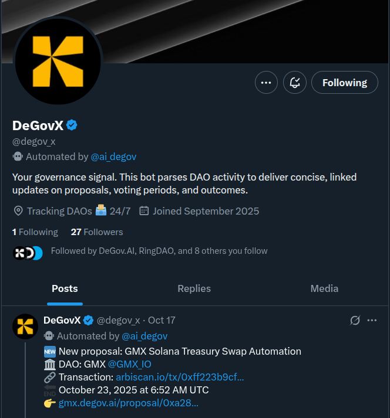

[DeGovX](https://x.com/degov_x) is an automated X account under DeGov.AI that aims to be your personal governance assistant.

You may care about multiple DAOs at the same time and keeping track of all the proposals and discussions can be overwhelming. Some DAOs may not provide good notification mechanisms either. DeGovX is here to help you stay informed and engaged with the DAOs you care about. It will deliver timely updates on new proposals, critical votes, and important discussions happening in those DAOs. You can follow DeGovX to
get timely updates without having to constantly check multiple governance platforms.

The main features of DeGovX is still under development, will gradually roll out more documents in this section to explain how to use DeGovX effectively.

