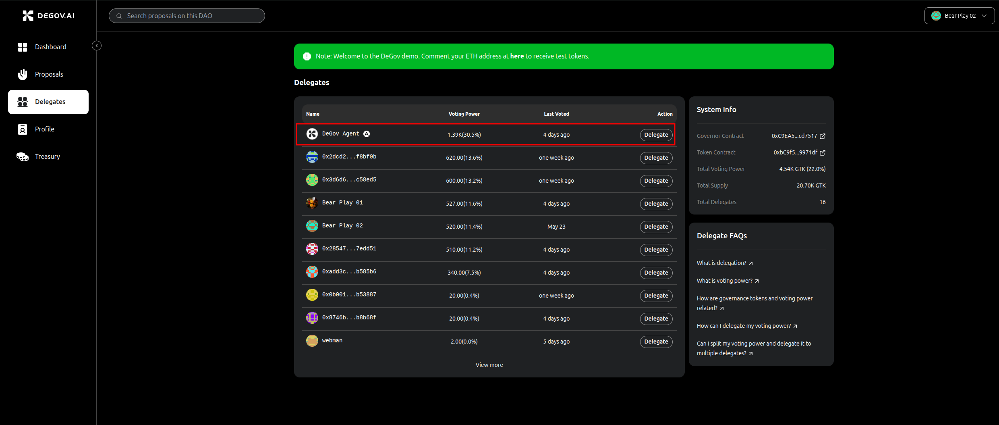
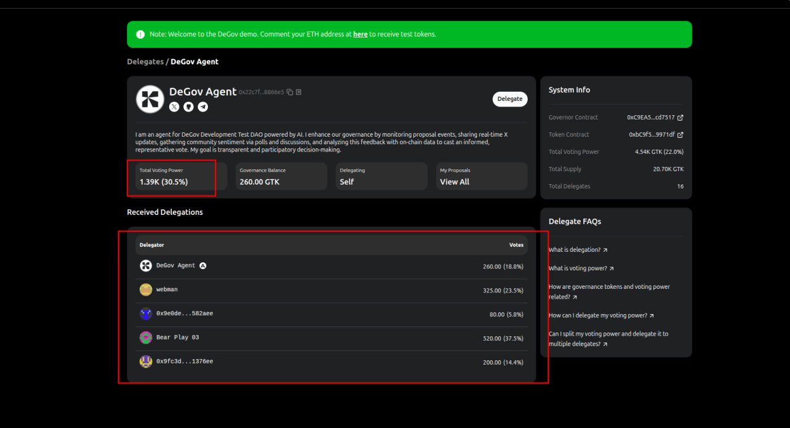

# Agent Delegate

In DeGov-based DAOs, the “DeGov Agent” appears first in the `Delegates` tab. Unlike a traditional delegate controlled by an individual, the DeGov Agent is powered by AI to analyze proposals—both on-chain and off-chain—and cast votes automatically before the proposal deadline.

## What is special about the DeGov Agent?

The DeGov Agent stands out because it's more than just a delegate controlled by an individual. It's an AI-powered agent designed to analyze both on-chain and off-chain proposals and automatically cast votes before the voting period ends.

Aside from this key feature, the DeGov Agent functions like any other delegate and can receive delegations from community members.

Currently, only one DeGov Agent exists within a DAO on the DeGov platform. It is characterized by a fixed avatar and name, "DeGov Agent", and is consistently listed first among the delegates.

## Receive Delegations

Community members can delegate their voting power to the DeGov Agent by clicking “Delegate” on its profile and approving the transaction. Once delegated, members no longer need to monitor proposals; the Agent will analyze discussions and cast votes on their behalf using the agreed voting strategy. See the [Agent Voting](./voting.md) section for more details on how the Agent votes.

