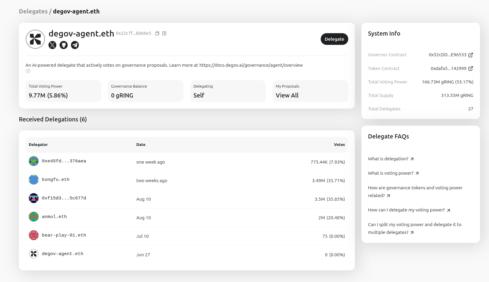

# `degov-agent.eth` Delegate

In degov square DAOs, there is an option to add the `degov-agent.eth` as a delegate. If this entity is added, it will always appear first in the list of delegates.

Unlike other delegates controlled by individuals, the `degov-agent.eth` is a special one powered by AI. There is no difference between it and other delegates other than its automated nature. The biggest advantage of this
special delegate is that it will always on duty to analyze proposals and cast votes before the voting period ends. As long as you trust the agent's voting strategy, you can delegate your voting power to it and let it handle the rest for you.

## `degov-agent.eth` can receive delegations

As the screenshot above shows, the `degov-agent.eth` can receive delegations like any other delegate. To delegate to the agent, simply click on the "Delegate" button on its profile page and approve the transaction. 

Once you have delegated to the agent, the `degov-agent.eth` will automatically analyze proposals and vote on your behalf according to the agreed voting strategy. See the [Agent Voting](./voting.md) section for more details on how the agent votes.