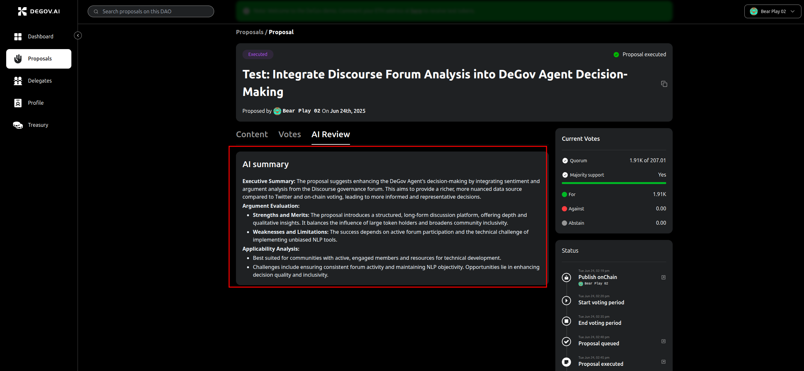

# Agent Proposal Review

Agent proposal review helps community members quickly understand each governance proposal. We’ve seen many proposals that are overly technical or complex, making it difficult for members to assess their impact and decide confidently. The agent review addresses this by providing a clear, balanced analysis of each proposal’s advantages, disadvantages, risks, and potential impact.

You can find the agent review in the proposal detail page, as shown below:

