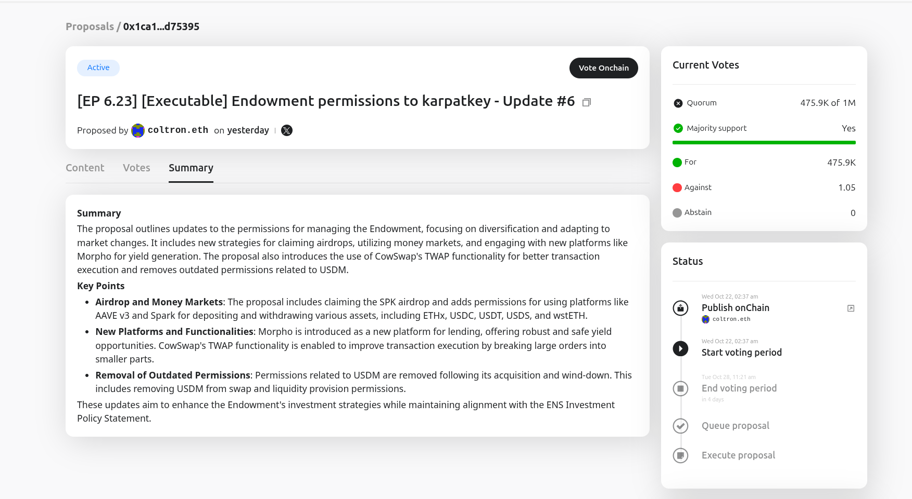

# Agent Summary

It's easy to get headaches when reviewing complex governance proposals. Agent proposal summary is here to help.

The agent will provide a concise summary of the proposal and highlight key points such as advantages, disadvantages, risks, and potential impacts. This will help community members quickly grasp the essence of the proposal and make informed decisions.