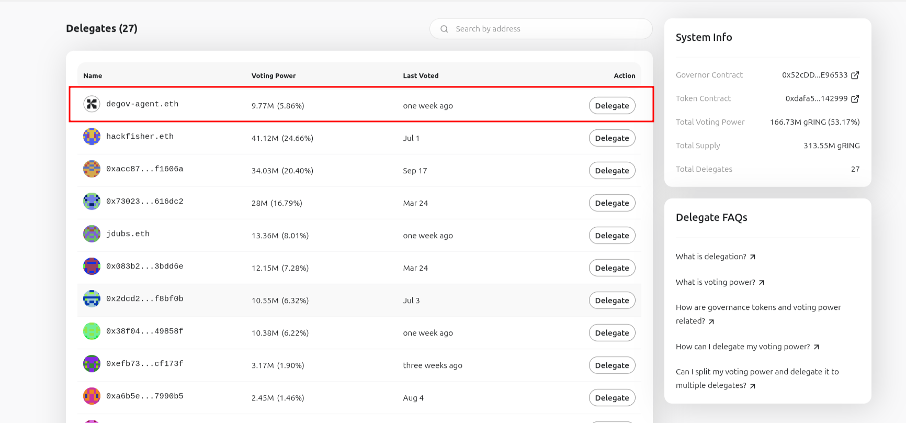
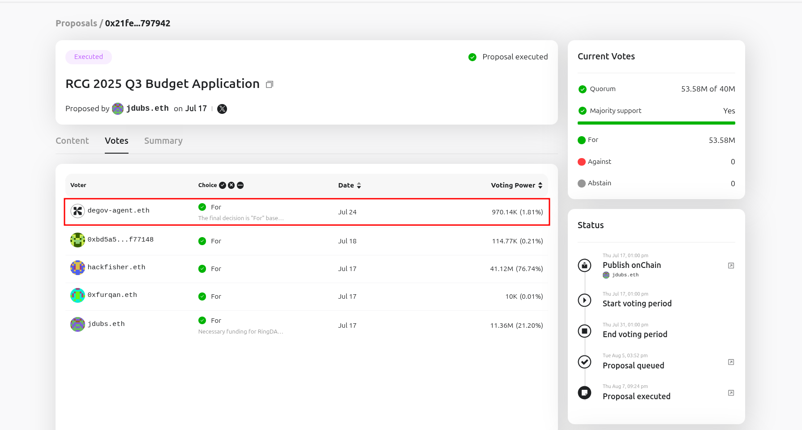
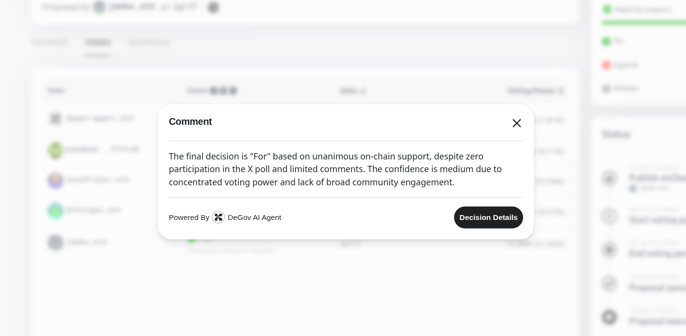

# Agent Voting

Agent voting refers to the specific delegate `degov-agent.eth` automatically analyzing governance proposals and casting votes on behalf of community members who have delegated to it.

Once there are active proposals in the DAO, the `degov-agent.eth` will monitor all voter's discussions, existing votes, and off-chain signals, then use its AI-powered strategy to decide how to vote before the proposal deadline. See the screenshot below for a proposal [RCG 2025 Q3 Budget Application](https://gov.ringdao.com/proposal/0x21fe4d7b110c6263187dce84bd95a9017a9b0aa88f4136d65090432527797942) in RingDAO of the agent's vote on a proposal.

The agent will also attach a comment explaining the reasoning behind its vote, like this:

