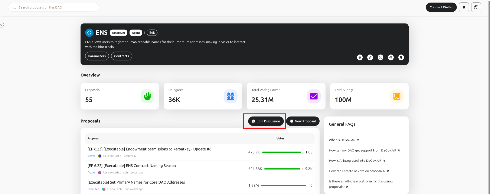

# Onchain and Offchain Governance

In the realm of DAO governance, it has two primary approaches: onchain and offchain governance. Both methods have their unique advantages and trade-offs, and they can be employed in different scenarios depending on the needs of the community. Understanding the distinctions between these methods is crucial for designing effective governance systems that align with a community's needs and values. 

## Onchain Governance

Onchain governance refers to decision-making processes, such as proposal voting and execution, that occur directly on the smart contract of the blockchain.

The advantages of onchain governance lies in its transparency, immutability, and trustlessness. All the decisions made are transparently recorded on the blockchain, ensuring that they cannot be altered or tampered with. That's especially important for DAOs with big communities and significant treasury management, where trust minimization is critical. The automatic execution of decisions through smart contracts eliminates the need for intermediaries, reducing the risk of censorship or manipulation. 

The disadvantages is apparently the cost and speed. Every action taken onchain incurs gas fees, which can be a barrier for smaller token holders to participate. The process can also be slower due to block confirmation times and voting periods, which may hinder rapid decision-making in fast-paced environments.

## Offchain Governance

Offchain governance refers to decision-making processes, such as proposal voting, discussion, and sentiment gathering, that occur outside the blockchain. Once a consensus is reached offchain, a trusted party (like a multi-signature wallet or admin) will execute the proposal onchain.

The advantages of offchain governance include flexibility, cost-efficiency, and speed. Communities can utilize various discussion platforms (like Discourse, Discord) and polling tools (like Snapshot) to gather input and gauge sentiment without incurring gas fees. This approach allows for rapid iteration and adaptation of governance processes, making it easier for communities to engage in discussions and provide qualitative feedback.

The disadvantages lies in its reliance on trusted entities to implement decisions onchain, which can introduce centralization risks. Even if a consensus is reached offchain, the lack of inherent binding power means that decisions may not be executed as intended. Additionally, offchain polls can be more susceptible to manipulation and Sybil attacks, and discussions may become fragmented across multiple platforms, making it challenging to maintain a cohesive community dialogue.

## Comparing Onchain and Offchain Governance

| Feature             | Onchain Governance                                  | Offchain Governance                                       |
| ------------------- | -------------------------------------------------------------- | --------------------------------------------------------- |
| **Execution**       | Automatic, by smart contract                                   | Manual, requires trusted party to implement onchain       |
| **Binding**         | Decisions are binding and automatically enforced               | Decisions are signals, non-binding without onchain action |
| **Cost**            | Incurs gas fees for transactions                               | Generally free or very low cost                           |
| **Speed**           | Slower, tied to block times and voting periods                 | Faster, informal polling and discussion                   |
| **Transparency**    | Fully transparent and auditable on the blockchain             | Varies by platform; discussions may be public or private  |
| **Security**        | High, inherits blockchain security; Sybil-resistant            | Lower, depends on platform; potential for manipulation    |
| **Participation**   | Can be lower due to cost/complexity                            | Often higher due to ease of access and low cost           |
| **Flexibility**     | Less flexible; rule changes require onchain votes              | Highly flexible; tools and processes can adapt quickly    |
| **Trust**           | Trust in code and protocol                                     | Trust in community, multi-sig holders, or platform admins |
| **Primary Use Case**| Formal proposals, treasury management, protocol upgrades       | Community sentiment, informal polls, discussion, ideation |

## The DeGov Square Approach: Onchain

DeGov Square focuses on onchain governance and is based on the OpenZeppelin Governor framework. For onchain governance, smart contract security is the top priority. Choosing well-audited and battle-tested governance frameworks is a wise decision compared to building one from scratch. This approach is DeGov Square's core value proposition.

Although DeGov Square emphasizes onchain governance, we also recommend discussing ideas and gathering community sentiment offchain before formalizing proposals onchain. To facilitate this, we provide an offchain discussion entry point in the main UI that links to your community forums (e.g., Discourse, Discord). This can be configured in your `degov.yml` file via the `offChainDiscussionUrl` property, as shown below:

