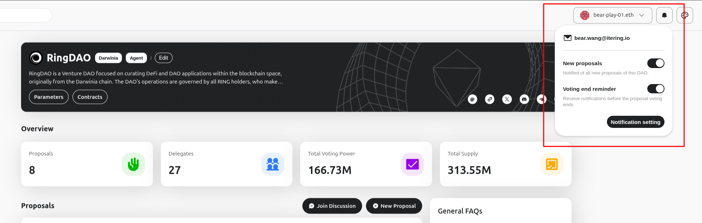
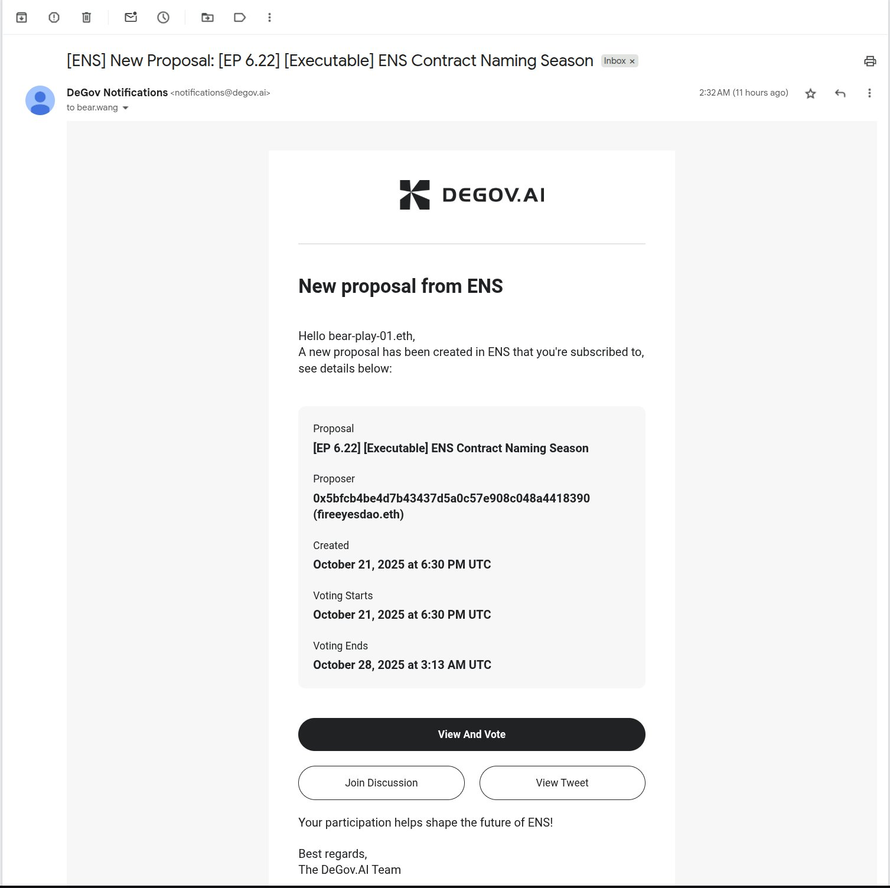
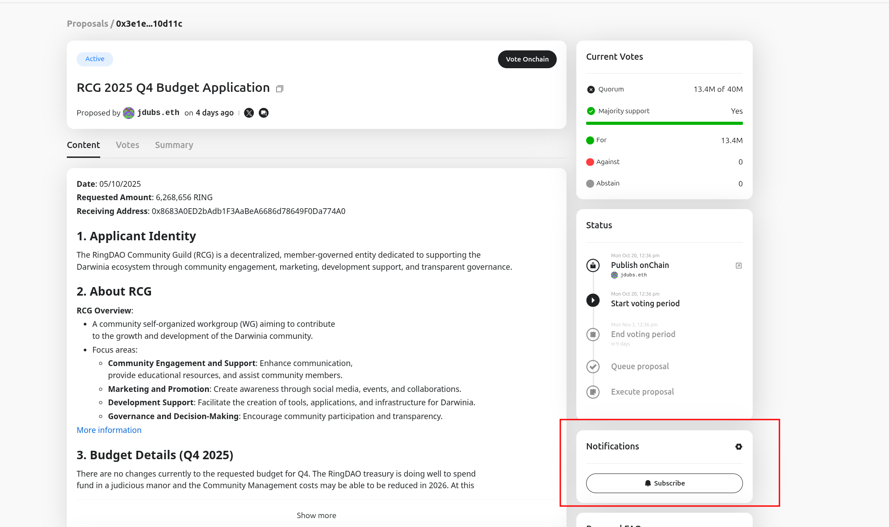
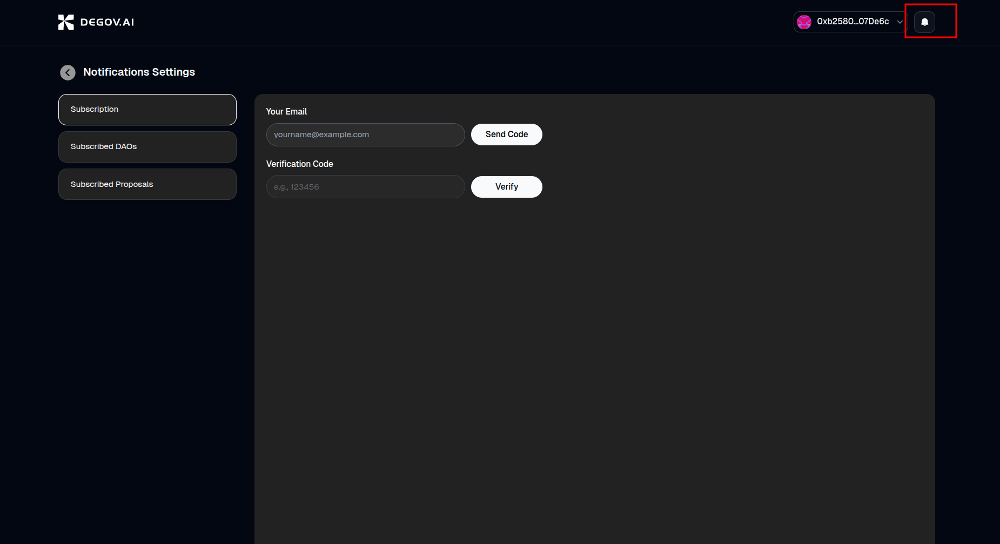
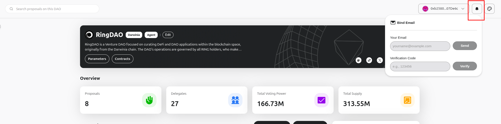
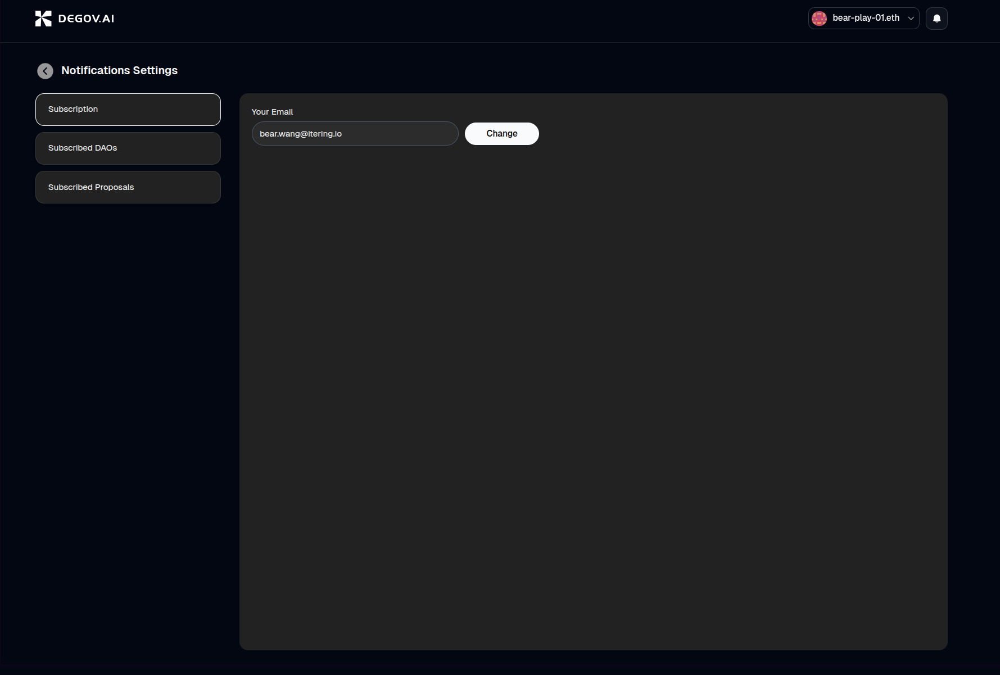
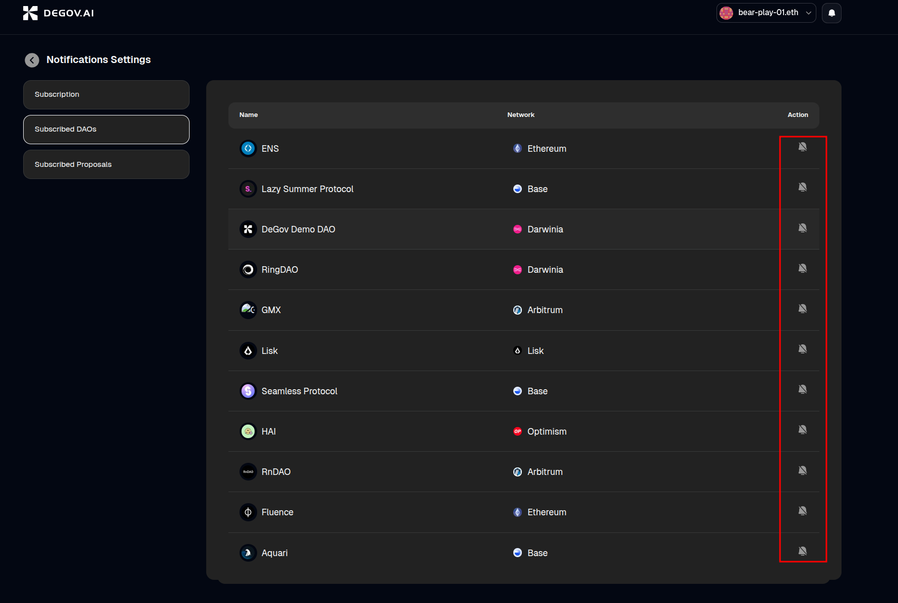
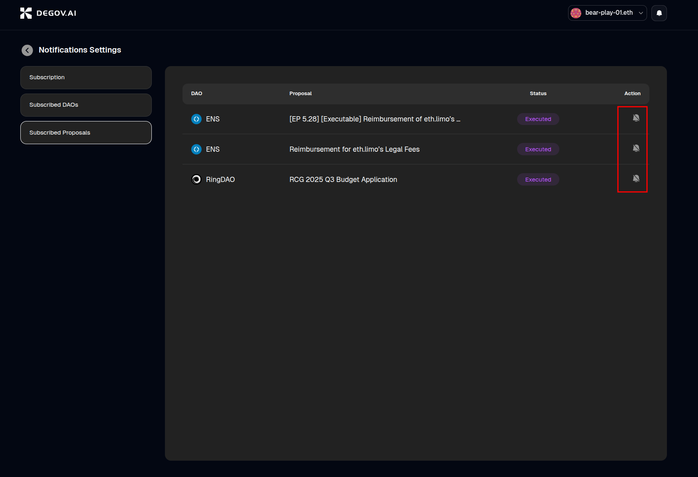

In the fast-paced Web3 ecosystem, staying updated on project activities is crucial for stakeholders. It enables informed decision-making and helps prevent asset loss that can result from missing important votes. DeGov Square provides email notifications to keep you informed about significant activities within the DAOs you participate in.

## Notification Types

DeGov Square offers two kinds of email notifications:

1. DAO-Level Notifications

    The subscription option is available on a DAO's main page, such as [https://gov.ringdao.com](https://gov.ringdao.com). You can choose between two notification types: `New proposal` and `Voting end reminder`. As the names suggest, `New proposal` notifies you when a new proposal is created in the DAO, and `Voting end reminder` notifies you when a proposal's voting period is about to end.

    

    Once you select a notification type, you will receive an email like the one below:

    

2. Proposal-Level Notifications

    The subscription option is located on the proposal page. For example, on this [example proposal](https://gov.ringdao.com/proposal/0x3e1eca86c1d0ad3d105a40d28c075c1dc390c07cb4502024664744f5dc10d11c), you can click the `Subscribe` button to receive notifications about any updates for this specific proposal, such as status changes.

    

## Notification Management

### Binding Your Email Address

To receive email notifications, you must first bind an email address to your wallet account. There are two ways to do this:

1. Bind via [DeGov Square](https://square.degov.ai/notification/subscription): Open DeGov Square, click the notification icon in the top-right corner, and enter your email address to bind it. Once bound, the wallet and email addresses will be linked and applied to all DAOs you interact with on DeGov Square.

    

2. Bind via a [Specific DAO Page](https://gov.ringdao.com): Open the DAO page, click the notification icon in the top-right corner, and enter your email address to bind it. This will also link your wallet and email addresses for all DAOs you interact with on DeGov Square.

    

Once your email is bound, you can subscribe to notifications at both the DAO and proposal levels as described above.

### Unsubscribing from Email Notifications

You can manage all your email subscriptions on the [DeGov Square Notification Management Page](https://square.degov.ai/notification/subscription). This page displays all the DAOs and proposals you are subscribed to, allowing you to unsubscribe from any of them by clicking the `Unsubscribe` button next to each entry.

1. Change your email address

    

2. Unsubscribe from DAO-level notifications

    

3. Unsubscribe from proposal-level notifications

    