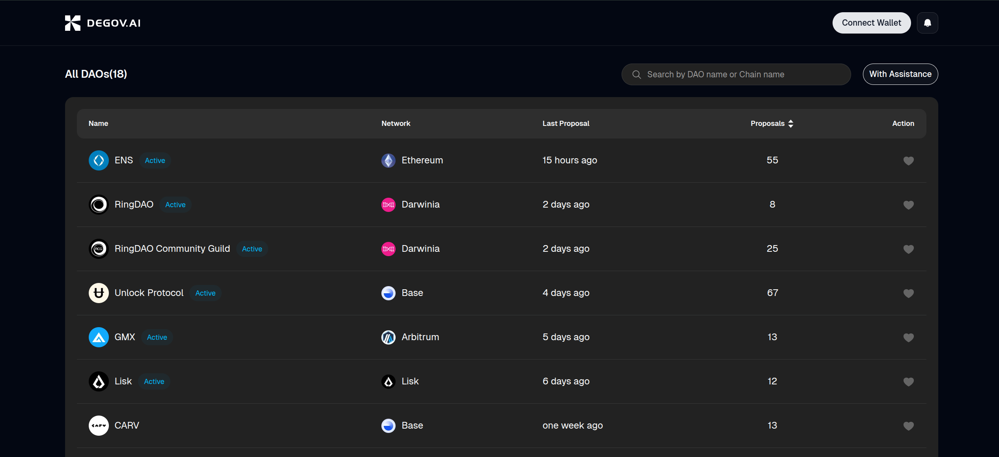

DeGov Square is an on‑chain SaaS governance platform built on the latest [OpenZeppelin Governor](https://docs.openzeppelin.com/contracts/5.x/governance), which is a secure and flexible framework for building governance systems on the blockchain. It leverages the open‑source [degov](https://github.com/ringecosystem/degov) core UI to provide a simple, powerful interface for interacting with Governor-based DAOs. See the DAOs here [https://square.degov.ai](https://square.degov.ai) for details.

