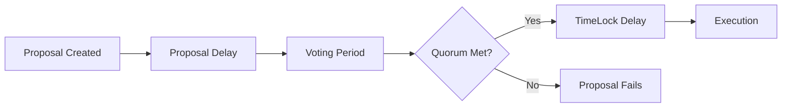

# Governance Parameters Overview

!!! info "Getting Started"
    If you're unsure where to start, use the **Balanced** configuration above and monitor your DAO's governance metrics over the first few months. Most successful DAOs adjust their parameters 2-3 times in their first year based on actual usage patterns.

DeGov.AI governance is built on [OpenZeppelin Governor](https://docs.openzeppelin.com/contracts/5.x/api/governance#governor), which uses several key parameters to control the governance process. These parameters determine how proposals are created, voted on, and executed, directly impacting your DAO's security, efficiency, and inclusivity.

## Core Parameters

| Parameter                                       | What it controls                                 | Typical range           | Impact                          |
| :---------------------------------------------- | :----------------------------------------------- | :---------------------- | :------------------------------ |
| [Proposal Thresholds](proposal-thresholds.md) | Minimum tokens needed to create proposals        | 0.01% - 1% of token supply | Spam prevention vs accessibility |
| [Voting Delay (Proposal Delay)](proposal-delay.md) | Time between proposal creation and voting start | 6 hours - 7 days        | Review time vs decision speed   |
| [Voting Period](voting-period.md)               | Duration of the voting phase                     | 3 - 14 days             | Participation vs efficiency     |
| [Quorum](quorum.md)                             | Minimum participation needed for valid votes     | 3% - 20% of token supply | Security vs operational capability |
| [TimeLock Delay](timelock-delay.md)             | Delay between successful vote and execution      | 24 hours - 30 days      | Security vs agility             |

## Parameter Relationships

These parameters work together to create your governance framework:

## Quick Configuration Guide

| Configuration          | Proposal Threshold | Voting Delay | Voting Period | Quorum      | TimeLock |
| :--------------------- | :----------------- | :----------- | :------------ | :---------- | :------- |
| **Conservative (High Security)** | 0.5% of supply     | 3 days       | 14 days       | 15% of supply | 14 days  |
| **Balanced (Recommended)** | 0.1% of supply     | 1 day        | 7 days        | 10% of supply | 7 days   |
| **Agile (Fast Moving)** | 0.01% of supply    | 6 hours      | 3 days        | 5% of supply  | 2 days   |

## Best Practices

1. **Start Conservative**: Begin with higher security parameters and relax as community matures
2. **Monitor Metrics**: Track participation, proposal success rates, and execution patterns
3. **Iterate Based on Data**: Adjust parameters based on actual usage patterns
4. **Community Input**: Involve the community in parameter discussions
5. **Document Changes**: Keep clear records of parameter changes and rationale
