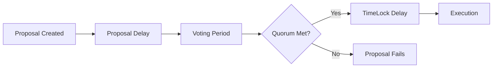

# Governance Parameters Overview

DeGov.AI governance is built on OpenZeppelin Governor, which uses several key parameters to control the governance process. These parameters determine how proposals are created, voted on, and executed, directly impacting your DAO's security, efficiency, and inclusivity.

## Core Parameters

### [Proposal Thresholds](proposal-thresholds.md)
**What it controls**: Minimum tokens needed to create proposals  
**Typical range**: 0.01% - 1% of token supply  
**Impact**: Spam prevention vs accessibility

### [Voting Delay (Proposal Delay)](proposal-delay.md)
**What it controls**: Time between proposal creation and voting start  
**Typical range**: 6 hours - 7 days  
**Impact**: Review time vs decision speed

### [Voting Period](voting-period.md)
**What it controls**: Duration of the voting phase  
**Typical range**: 3 - 14 days  
**Impact**: Participation vs efficiency

### [Quorum](quorum.md)
**What it controls**: Minimum participation needed for valid votes  
**Typical range**: 3% - 20% of token supply  
**Impact**: Security vs operational capability

### [TimeLock Delay](timelock-delay.md)
**What it controls**: Delay between successful vote and execution  
**Typical range**: 24 hours - 30 days  
**Impact**: Security vs agility

## Parameter Relationships

These parameters work together to create your governance framework:

## Quick Configuration Guide

### Conservative (High Security)
- **Proposal Threshold**: 0.5% of supply
- **Voting Delay**: 3 days
- **Voting Period**: 14 days
- **Quorum**: 15% of supply
- **TimeLock**: 14 days

### Balanced (Recommended)
- **Proposal Threshold**: 0.1% of supply
- **Voting Delay**: 1 day
- **Voting Period**: 7 days
- **Quorum**: 10% of supply
- **TimeLock**: 7 days

### Agile (Fast Moving)
- **Proposal Threshold**: 0.01% of supply
- **Voting Delay**: 6 hours
- **Voting Period**: 3 days
- **Quorum**: 5% of supply
- **TimeLock**: 2 days

## Best Practices

1. **Start Conservative**: Begin with higher security parameters and relax as community matures
2. **Monitor Metrics**: Track participation, proposal success rates, and execution patterns
3. **Iterate Based on Data**: Adjust parameters based on actual usage patterns
4. **Community Input**: Involve the community in parameter discussions
5. **Document Changes**: Keep clear records of parameter changes and rationale

## Common Challenges

### Low Participation
- **Symptoms**: Proposals fail due to quorum
- **Solutions**: Lower quorum, improve engagement, extend voting periods

### Governance Attacks
- **Symptoms**: Suspicious proposals or voting patterns
- **Solutions**: Increase thresholds, extend delays, implement monitoring

### Slow Decision Making
- **Symptoms**: Critical decisions take too long
- **Solutions**: Reduce delays, create emergency procedures, use tiered parameters

## Parameter Tuning Strategy

1. **Launch Phase**: Conservative parameters for security
2. **Growth Phase**: Balanced parameters for active governance
3. **Maturity Phase**: Optimized parameters based on community behavior
4. **Ongoing**: Regular review and adjustment based on metrics

## Emergency Considerations

Plan for scenarios requiring parameter adjustment:
- **Security incidents**: May need to increase delays/thresholds
- **Market volatility**: Could affect token distribution and participation
- **Technical issues**: May require temporary parameter relaxation
- **Community growth**: Successful engagement may allow more aggressive parameters

!!! info "Getting Started"
    If you're unsure where to start, use the **Balanced** configuration above and monitor your DAO's governance metrics over the first few months. Most successful DAOs adjust their parameters 2-3 times in their first year based on actual usage patterns.