# Proposal Lifecycle

Understanding how proposals move from idea to reality is key to participating in DeGov.AI governance. Think of it like following a bill through government - there are specific stages each proposal must go through before becoming law.

## The Journey: From Idea to Implementation

Every proposal follows the same path, with built-in checkpoints to ensure the community has control over what happens.

Here's how proposals move through the system:

```mermaid
graph TD
    A["💡 New Idea"] --> B["⏳ Getting Ready"]
    B --> C["🗳️ Voting Time"]
    B --> D["❌ Canceled"]
    C --> E["👎 Failed"]
    C --> F["✅ Passed"]
    F --> G["⏰ Safety Check"]
    G --> I["🚀 Live Changes"]
    
    classDef failed fill:#ffcccc
    classDef success fill:#ccffcc
    classDef active fill:#ffffcc
    
    class D,E failed
    class I success
    class B,C,F,G active
```



### Stage 1: Getting Ready (Pending)

**What happens**: Someone just created a proposal, but voting hasn't started yet.

**Why the wait**: This gives everyone time to:

- Read and understand what's being proposed
- Discuss it in community forums
- Prepare to vote thoughtfully

**How long**: Usually about 1 day, depending on the [proposal threshold](../parameters/proposal-thresholds.md) set by the community.

**What you can do**: 

- Review the proposal details
- Join discussions about it
- Decide how you want to vote

### Stage 2: Voting Time (Active)

**What happens**: The community votes on whether they support the proposal.

**Your choices**:

- **Yes (For)**: You support this change
- **No (Against)**: You oppose this change  
- **Abstain**: You don't have a strong opinion but want to participate

**How long**: Typically 1 week, depends on the [voting period](../parameters/voting-period.md) set by the community.

**Important**: Your voting power is based on how many tokens you owned when the proposal was created, not how many you have now.

!!! tip "Voting Snapshot"
    The system takes a "snapshot" of everyone's token holdings when voting starts. This prevents people from buying tokens just to influence a vote and then selling them immediately.

### Stage 3: Counting the Results

After voting ends, the system automatically checks two things:

**Did enough people vote?** (Quorum)

- There's a minimum number of people who need to participate
- This ensures decisions represent the community, not just a few individuals

**Did more people vote "Yes" than "No"?**

- Simple majority rule
- Abstain votes count toward participation but don't affect the yes/no outcome

### Stage 4A: If the Proposal Failed (Defeated)

**What this means**: Not enough people voted "Yes" or not enough people participated.

**What happens next**: 

- The proposal stops here
- No changes are made
- Someone could create a new, similar proposal later if they want

### Stage 4B: If the Proposal Passed (Succeeded)

**What this means**: The community approved the changes!

**But wait**: Even successful proposals don't happen immediately...

### Stage 5: Safety Check Period (Queued)

**What happens**: Approved proposals enter a waiting period for safety.

**Why this matters**: 

- Gives the community time for final review
- Allows experts to double-check everything
- Provides a window to catch any potential problems

**How long**: Usually 2 days, but can vary based on the [timelock delay](../parameters/timelock-delay.md) set by the community.

**Think of it like**: A "cooling off" period to make sure everyone is comfortable with what was approved.

### Stage 6: Making It Happen (Executed)

**What this means**: Someone triggered the approved changes!

**Who can do this**: Anyone in the community (it's usually automated)

**What happens**: The changes go live on the platform.

## Example Timeline

Here's what a typical successful proposal looks like:

| Day | What's Happening | What You Can Do |
|-----|------------------|-----------------|
| 1 | Proposal created, getting ready | Read and discuss |
| 2-8 | Voting is open | Cast your vote |
| 9 | Votes are counted | Wait for results |
| 9 | Proposal passed! Safety period starts | Review final details |
| 11 | Safety period ends, ready to implement | Wait for execution |
| 12 | Changes go live! | See the new features |

## Special Situations

### Emergency Stops

Sometimes proposals need to be stopped quickly:

- **Who can stop them**: Trusted community guardians (if configured)
- **When this happens**: If serious security issues are discovered
- **Why it's important**: Protects the community from potential harm

### Proposal Creator Changes Mind

- **Before voting starts**: Creators can cancel their own proposals
- **During voting**: Once voting begins, creators usually can't cancel
- **Why**: Ensures the voting process is fair and predictable


## Learn More

Want to understand other aspects of governance?

- [Proposal Overview](overview.md) - What proposals are and how they work
- [Voting Guide](voting.md) - Everything about casting your vote  
- [Vote Delegation](delegation.md) - How to delegate your voting power
- [Governance Parameters](../parameters/overview.md) - The parameters that govern the system

---

## Technical Implementation Details

For developers and technically-minded users working with OpenZeppelin Contracts 5.x:

### Core Governor Architecture

The governance system is built using OpenZeppelin's modular Governor architecture:

```solidity
import {Governor} from "@openzeppelin/contracts/governance/Governor.sol";
import {GovernorCountingSimple} from "@openzeppelin/contracts/governance/extensions/GovernorCountingSimple.sol";
import {GovernorVotes} from "@openzeppelin/contracts/governance/extensions/GovernorVotes.sol";
import {GovernorVotesQuorumFraction} from "@openzeppelin/contracts/governance/extensions/GovernorVotesQuorumFraction.sol";
import {GovernorTimelockControl} from "@openzeppelin/contracts/governance/extensions/GovernorTimelockControl.sol";
```

### State Management

Proposals progress through states defined by the `IGovernor.ProposalState` enum:

```solidity
enum ProposalState {
    Pending,    // Voting delay active (pre-voting)
    Active,     // Voting period active  
    Canceled,   // Terminated early by proposer/guardian
    Defeated,   // Failed voting requirements
    Succeeded,  // Passed voting requirements
    Queued,     // In timelock delay
    Executed    // Changes implemented
}
```

### State Transition Logic

The core state determination follows OpenZeppelin's proven patterns:

```solidity
function state(uint256 proposalId) 
    public view override(Governor, GovernorTimelockControl) 
    returns (ProposalState) {
    // State logic considers:
    // - ERC-6372 clock (timestamps or block numbers)
    // - Vote tallies via counting modules
    // - Quorum calculations
    // - Timelock status and delays
    return super.state(proposalId);
}
```

### Voting Power & Clock System

DeGov.AI uses the [ERC-6372](https://eips.ethereum.org/EIPS/eip-6372) standard for time-based operations:

```solidity
// Token implements IERC6372 for timestamp-based governance
function clock() public view override returns (uint48) {
    return uint48(block.timestamp);
}

function CLOCK_MODE() public pure override returns (string memory) {
    return "mode=timestamp";
}
```

### Key Functions

**Proposal Creation**

```solidity
function propose(
    address[] memory targets,
    uint256[] memory values,
    bytes[] memory calldatas,
    string memory description
) public returns (uint256 proposalId);
```

**Voting Functions**
```solidity
function castVote(uint256 proposalId, uint8 support) public returns (uint256 balance);
function castVoteWithReason(uint256 proposalId, uint8 support, string calldata reason) public;
function castVoteBySig(uint256 proposalId, uint8 support, address voter, bytes memory signature) public;
```

**Lifecycle Management**
```solidity
function queue(address[] memory targets, uint256[] memory values, bytes[] memory calldatas, bytes32 descriptionHash) public;
function execute(address[] memory targets, uint256[] memory values, bytes[] memory calldatas, bytes32 descriptionHash) public;
function cancel(address[] memory targets, uint256[] memory values, bytes[] memory calldatas, bytes32 descriptionHash) public;
```

### Voting Mechanisms
DeGov.AI uses `GovernorCountingSimple` with three voting options:

- **0 = Against**: Opposition to the proposal
- **1 = For**: Support for the proposal  
- **2 = Abstain**: Participation without opinion (counts toward quorum)

### Quorum & Thresholds
```solidity
// Quorum as percentage of total supply at proposal snapshot
contract DeGovGovernor is GovernorVotesQuorumFraction {
    constructor() GovernorVotesQuorumFraction(4) {} // 4% quorum
}

// Proposal threshold (minimum tokens needed to propose)
function proposalThreshold() public pure override returns (uint256) {
    return 1000e18; // 1000 tokens
}
```

### Event System
The governance system emits comprehensive events for tracking:

```solidity
event ProposalCreated(
    uint256 proposalId,
    address proposer,
    address[] targets,
    uint256[] values,
    string[] signatures,
    bytes[] calldatas,
    uint256 voteStart,
    uint256 voteEnd,
    string description
);

event VoteCast(
    address indexed voter,
    uint256 proposalId,
    uint8 support,
    uint256 weight,
    string reason
);

event ProposalQueued(uint256 proposalId, uint256 etaSeconds);
event ProposalExecuted(uint256 proposalId);
event ProposalCanceled(uint256 proposalId);
```

### Timelock Integration
When using timelock, proposals require a two-step execution:

```solidity
// 1. Queue after voting succeeds
function _queueOperations(
    uint256 proposalId,
    address[] memory targets,
    uint256[] memory values,
    bytes[] memory calldatas,
    bytes32 descriptionHash
) internal override returns (uint48) {
    return super._queueOperations(proposalId, targets, values, calldatas, descriptionHash);
}

// 2. Execute after timelock delay
function _executeOperations(
    uint256 proposalId,
    address[] memory targets,
    uint256[] memory values,
    bytes[] memory calldatas,
    bytes32 descriptionHash
) internal override {
    super._executeOperations(proposalId, targets, values, calldatas, descriptionHash);
}
```

### Security Features
- **Proposal Guardian**: Optional role that can cancel proposals at any stage
- **Vote Snapshots**: Voting power captured at proposal creation (prevents vote buying)
- **Signature Voting**: [ERC-1271](https://eips.ethereum.org/EIPS/eip-1271) support for contract-based voting
- **Reentrancy Protection**: Built-in safeguards in all state-changing functions