# Proposal Lifecycle

Understanding how proposals move from idea to reality is key to participating in DeGov.AI governance. Think of it like following a bill through government - there are specific stages each proposal must go through before becoming law.

## The Journey: From Idea to Implementation

Every proposal follows the same path, with built-in checkpoints to ensure the community has control over what happens.

### Stage 1: Getting Ready (Pending)

**What happens**: Someone just created a proposal, but voting hasn't started yet.

**Why the wait**: This gives everyone time to:
- Read and understand what's being proposed
- Discuss it in community forums
- Prepare to vote thoughtfully

**How long**: Usually about 1 day

**What you can do**: 
- Review the proposal details
- Join discussions about it
- Decide how you want to vote

### Stage 2: Voting Time (Active)

**What happens**: The community votes on whether they support the proposal.

**Your choices**:
- **Yes (For)**: You support this change
- **No (Against)**: You oppose this change  
- **Abstain**: You don't have a strong opinion but want to participate

**How long**: Typically 1 week

**Important**: Your voting power is based on how many tokens you owned when the proposal was created, not how many you have now.

!!! tip "Voting Snapshot"
    The system takes a "snapshot" of everyone's token holdings when voting starts. This prevents people from buying tokens just to influence a vote and then selling them immediately.

### Stage 3: Counting the Results

After voting ends, the system automatically checks two things:

**Did enough people vote?** (Quorum)
- There's a minimum number of people who need to participate
- This ensures decisions represent the community, not just a few individuals

**Did more people vote "Yes" than "No"?**
- Simple majority rule
- Abstain votes count toward participation but don't affect the yes/no outcome

### Stage 4A: If the Proposal Failed (Defeated)

**What this means**: Not enough people voted "Yes" or not enough people participated.

**What happens next**: 
- The proposal stops here
- No changes are made
- Someone could create a new, similar proposal later if they want

### Stage 4B: If the Proposal Passed (Succeeded)

**What this means**: The community approved the changes!

**But wait**: Even successful proposals don't happen immediately...

### Stage 5: Safety Check Period (Queued)

**What happens**: Approved proposals enter a waiting period for safety.

**Why this matters**: 
- Gives the community time for final review
- Allows experts to double-check everything
- Provides a window to catch any potential problems

**How long**: Usually 2 days

**Think of it like**: A "cooling off" period to make sure everyone is comfortable with what was approved.

### Stage 6A: Time Ran Out (Expired)

**What this means**: The safety period ended, but no one implemented the changes.

**Why this might happen**:
- Technical difficulties
- Changed circumstances
- Community decided not to proceed

**What happens**: The proposal can no longer be implemented.

### Stage 6B: Making It Happen (Executed)

**What this means**: Someone triggered the approved changes!

**Who can do this**: Anyone in the community (it's usually automated)

**What happens**: The changes go live on the platform.

## Example Timeline

Here's what a typical successful proposal looks like:

| Day | What's Happening | What You Can Do |
|-----|------------------|-----------------|
| 1 | Proposal created, getting ready | Read and discuss |
| 2-8 | Voting is open | Cast your vote |
| 9 | Votes are counted | Wait for results |
| 9 | Proposal passed! Safety period starts | Review final details |
| 11 | Safety period ends, ready to implement | Wait for execution |
| 12 | Changes go live! | See the new features |

## Special Situations

### Emergency Stops

Sometimes proposals need to be stopped quickly:

**Who can stop them**: Trusted community guardians (if configured)
**When this happens**: If serious security issues are discovered
**Why it's important**: Protects the community from potential harm

### Proposal Creator Changes Mind

**Before voting starts**: Creators can cancel their own proposals
**During voting**: Once voting begins, creators usually can't cancel
**Why**: Ensures the voting process is fair and predictable

## What If Something Goes Wrong?

### Failed Implementation
If approved changes don't work correctly:
- The community can propose fixes
- Technical experts investigate the issue
- New proposals can address the problems

### Changed Circumstances
If conditions change after approval:
- The community might decide not to implement
- New proposals can modify or replace old ones
- Discussion continues in community forums

## Your Role in the Process

### As a Token Holder
- **Stay informed** about new proposals
- **Vote thoughtfully** on issues you care about
- **Monitor progress** of proposals you supported
- **Engage in discussions** to help shape ideas

### As a Community Member
- **Share proposals** you think others should know about
- **Explain complex topics** to help others understand
- **Report concerns** if you notice problems
- **Celebrate successes** when good proposals pass

## Making the Most of Each Stage

### During the Preparation Period
- Read proposal descriptions carefully
- Ask questions if anything is unclear
- Research the background and implications
- Discuss with other community members

### During Voting
- Vote based on your honest assessment
- Don't wait until the last minute
- Consider long-term impacts, not just short-term benefits
- Remember that abstaining is also a valid choice

### During Implementation
- Watch for the changes to take effect
- Test new features or observe changes
- Provide feedback on how things are working
- Be patient - complex changes take time

## Learn More

Want to understand other aspects of governance?

- [Proposal Overview](overview.md) - What proposals are and how they work
- [Voting Guide](voting.md) - Everything about casting your vote  
- [Vote Delegation](delegation.md) - How to delegate your voting power
- [Governance Parameters](../parameters/overview.md) - The rules that govern the system

---

## Technical Implementation Details

For developers and technically-minded users:

### State Management
Proposals progress through states managed by smart contract logic:

```solidity
enum ProposalState {
    Pending,    // Voting delay active
    Active,     // Voting period active  
    Canceled,   // Terminated early
    Defeated,   // Failed voting requirements
    Succeeded,  // Passed voting requirements
    Queued,     // In timelock delay
    Expired,    // Grace period ended
    Executed    // Changes implemented
}
```

### State Transition Logic
```solidity
function state(uint256 proposalId) public view returns (ProposalState) {
    // Complex logic determines current state based on:
    // - Block timestamps
    // - Vote tallies  
    // - Quorum calculations
    // - Timelock status
}
```

### Key Functions
- `propose()`: Create new proposals
- `castVote()`: Submit votes during active period
- `queue()`: Add successful proposals to timelock
- `execute()`: Implement approved changes
- `cancel()`: Terminate proposals (limited conditions)

### Event Monitoring
Track proposal progress through emitted events:
- `ProposalCreated`
- `VoteCast` 
- `ProposalQueued`
- `ProposalExecuted`
- `ProposalCanceled`

## Visual Flow

Here's how proposals move through the system:

```mermaid
graph TD
    A[💡 New Idea] --> B[⏳ Getting Ready]
    B --> C[🗳️ Voting Time]
    B --> D[❌ Canceled]
    C --> E[👎 Failed]
    C --> F[✅ Passed]
    F --> G[⏰ Safety Check]
    F --> H[⌛ Time Up]
    G --> I[🚀 Live Changes]
    G --> J[⌛ Time Up]
    
    classDef failed fill:#ffcccc
    classDef success fill:#ccffcc
    classDef active fill:#ffffcc
    
    class D,E,H,J failed
    class I success
    class B,C,F,G active
```

