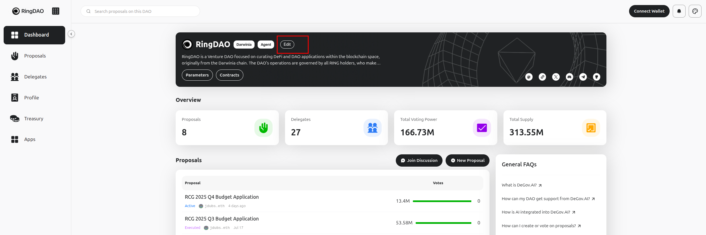

# DeGov Registry

The [DeGov Square](https://square.degov.ai) lists various DAOs that use DeGov for governance. The information for these DAOs is sourced from the [DeGov Registry](https://github.com/ringecosystem/degov-registry) repository. This registry serves as a centralized source for DAO configurations, which are defined in `degov.yml` files, simplifying management and updates for DAO maintainers.

You can also access a DAO's configuration from its dashboard. For example, clicking the edit button:

This will take you to the corresponding `degov.yml` file in the registry, like this example for [ring-dao.yml](https://github.com/ringecosystem/degov-registry/blob/main/daos/ring-dao.yml).